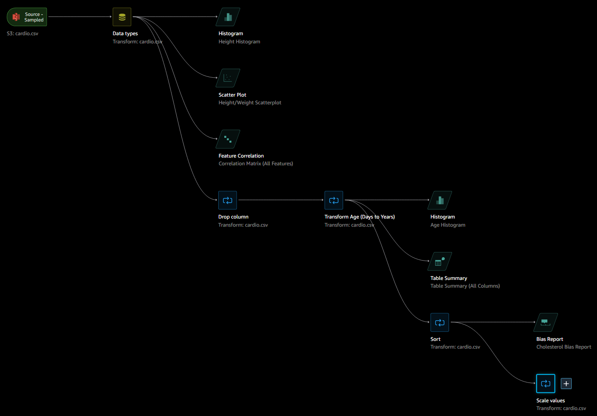

# AWS Data Wrangler

AWS SageMaker Data Wrangler flow used to perform exploratory Data Analysis (EDA).

* Read contents of cardio.csv data uploaded to S3 (Cardiovascular Disease dataset - https://www.kaggle.com/datasets/sulianova/cardiovascular-disease-dataset).
* Plot the histogram for the height column.
* Plot the scatterplot between the height and weight.
* Plot the correlation matrix between features.
* Drop the ID column
* Create a custom formula to convert age column from days to years. Round the age to the nearest integer
* Plot the histogram for the newly created age column
* Generate a summary table and list the average age value
* Sort the dataframe according the age column in an ascending order 
* Generate a bias report for the cholesterol column 
* Scale the weight, height, ap_lo and ap_hi using min max scaler

